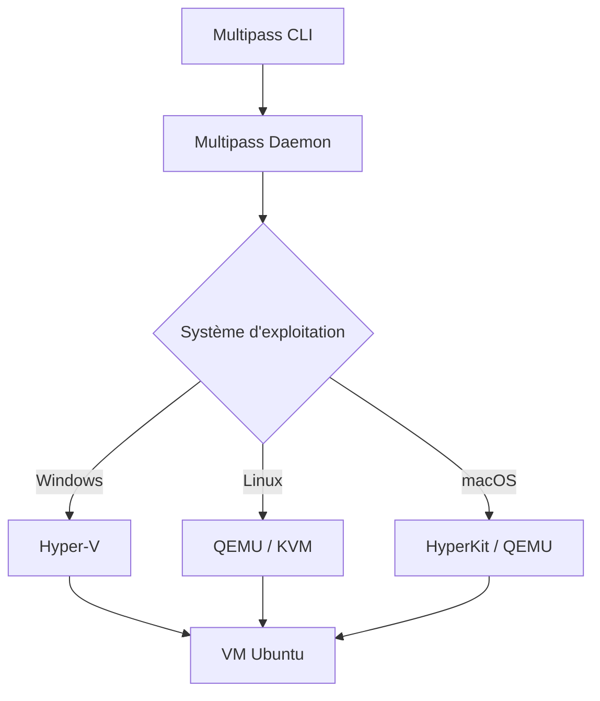

# Module 1 -- Introduction à Multipass

## Introduction

Avez-vous déjà eu besoin de tester un script sur une machine Linux
propre, sans risquer de casser votre environnement de travail ?
Ou peut-être avez-vous voulu reproduire exactement le même
environnement que celui de votre serveur de production, directement
sur votre poste de développeur ? Si ces situations vous parlent,
alors Multipass va devenir un outil incontournable dans votre
quotidien.

Imaginez que vous puissiez créer une machine virtuelle Ubuntu en une
seule commande, en moins de 30 secondes, et la détruire tout aussi
rapidement une fois votre travail terminé. C'est un peu comme
disposer d'un distributeur automatique de machines Linux : vous
appuyez sur un bouton, vous obtenez un environnement vierge prêt à
l'emploi, vous travaillez dedans, puis vous le jetez sans aucune
conséquence. Pas d'installation longue, pas de configuration
d'hyperviseur complexe, pas de fichiers ISO à télécharger.

Dans le monde professionnel, la capacité à créer rapidement des
environnements isolés est devenue essentielle. Que ce soit pour
tester une nouvelle version d'une librairie, valider un pipeline
CI/CD, ou simplement expérimenter sans risque, les développeurs ont
besoin d'outils légers et rapides. Multipass répond précisément à
ce besoin, et c'est pourquoi de nombreuses équipes l'ont adopté
comme outil de virtualisation au quotidien.

## Objectifs du module

Au terme de ce module vous serez capable de :

- Expliquer ce qu'est Multipass et son positionnement par rapport
  aux autres solutions de virtualisation
- Identifier les cas d'usage pertinents pour Multipass dans un
  contexte de développement
- Décrire l'architecture technique de Multipass selon le système
  d'exploitation utilisé

## Qu'est-ce que Multipass ?

### Présentation générale

Vous connaissez probablement VirtualBox ou VMware : ces logiciels
permettent de créer des machines virtuelles, mais ils demandent
souvent une configuration manuelle fastidieuse. Télécharger une
image ISO, configurer la machine, installer le système, attendre
les mises à jour... Tout cela peut prendre une bonne demi-heure
avant d'avoir un environnement fonctionnel.

Multipass, développé par Canonical (l'éditeur d'Ubuntu), adopte une
approche radicalement différente. C'est un outil en ligne de
commande qui permet de lancer des machines virtuelles Ubuntu
préconfigurées en quelques secondes. Pas d'interface graphique
complexe, pas de configuration manuelle : une seule commande suffit
pour obtenir une VM opérationnelle.

Voici comment Multipass se positionne face aux solutions existantes :

| Critère | Multipass | VirtualBox | VMware | WSL2 |
|---|---|---|---|---|
| Installation | Très simple | Modérée | Modérée | Intégrée |
| Temps de création d'une VM | ~30 secondes | ~30 minutes | ~30 minutes | ~2 minutes |
| Interface | CLI | GUI + CLI | GUI + CLI | CLI |
| OS invités | Ubuntu | Tous | Tous | Linux |
| Poids | Léger | Lourd | Lourd | Léger |
| Isolation | Complète | Complète | Complète | Partielle |
| Réseau entre VM | Oui | Oui | Oui | Limité |
| Cloud-init | Natif | Non | Non | Non |

La force de Multipass réside dans sa simplicité : il fait une chose
et il la fait bien. Si vous avez besoin d'une VM Ubuntu rapidement,
c'est l'outil le plus efficace. Si vous avez besoin de faire tourner
Windows ou macOS dans une VM, tournez-vous vers VirtualBox ou VMware.

```bash
# Créer une VM Ubuntu en une seule commande
multipass launch --name ma-vm
```

Cette commande crée une machine virtuelle Ubuntu avec des ressources
par défaut (1 CPU, 1 Go de RAM, 5 Go de disque), démarre la VM, et
la rend accessible en quelques secondes.

### Comparaison avec WSL2

Une question revient souvent : pourquoi utiliser Multipass quand on
dispose de WSL2 sous Windows ? WSL2 est effectivement excellent pour
exécuter un environnement Linux directement intégré à Windows. Mais
WSL2 partage le noyau avec le système hôte et ne fournit pas une
isolation complète. Avec Multipass, chaque instance est une véritable
machine virtuelle avec son propre noyau, sa propre pile réseau et
ses propres ressources. De plus, Multipass permet de créer plusieurs
instances indépendantes et de les faire communiquer entre elles, ce
qui est idéal pour simuler des architectures distribuées.

## Cas d'usage typiques

### Développement et test

Pensez à la dernière fois où vous avez dû tester votre application
sur un système propre, sans toutes les dépendances accumulées sur
votre machine de développement. Multipass vous permet de créer un
environnement vierge en quelques secondes, d'y déployer votre
application, de la tester, puis de détruire l'environnement.

```bash
# Créer une VM dédiée au test
multipass launch --name test-app --cpus 2 --memory 2G

# Se connecter et déployer
multipass shell test-app

# Une fois terminé, tout nettoyer
multipass delete test-app
multipass purge
```

#### Exemple pratique {id="exemple-dev-test"}

Vous développez une application Node.js et vous voulez vérifier
qu'elle s'installe correctement sur un système Ubuntu vierge :

```bash
# Créer un environnement de test propre
multipass launch --name test-node --memory 2G

# Installer Node.js dans la VM
multipass exec test-node -- sudo snap install node --classic

# Transférer votre projet (nous verrons cela en détail plus tard)
multipass transfer mon-projet.tar.gz test-node:/home/ubuntu/

# Tester l'installation
multipass exec test-node -- bash -c \
  "cd /home/ubuntu && tar xzf mon-projet.tar.gz && \
   cd mon-projet && npm install && npm test"
```

### Intégration continue et déploiement (CI/CD)

Dans un pipeline CI/CD, il est crucial de disposer d'environnements
reproductibles. Multipass, couplé à cloud-init (que nous verrons
au module 5), permet de provisionner automatiquement des machines
avec une configuration identique à chaque exécution. Vous pouvez
ainsi garantir que vos tests s'exécutent toujours dans les mêmes
conditions.

### Apprentissage et formation

C'est précisément le contexte de ce cours. Multipass est un outil
idéal pour apprendre l'administration système, la conteneurisation,
ou le déploiement d'applications. Vous pouvez expérimenter librement
sans jamais risquer d'endommager votre système hôte. Si quelque chose
tourne mal, il suffit de détruire la VM et d'en recréer une.

## Architecture de Multipass

### Comment Multipass fonctionne-t-il en coulisses ?

Pour comprendre l'architecture de Multipass, pensez à un traducteur
universel. Multipass parle le même langage quel que soit votre
système d'exploitation, mais en coulisses, il utilise l'hyperviseur
natif de votre plateforme pour créer les machines virtuelles. C'est
cette approche qui lui permet d'être aussi performant.



### Hyperviseur selon le système d'exploitation

**Sous Windows**, Multipass utilise par défaut Hyper-V, l'hyperviseur
intégré de Microsoft. C'est la configuration recommandée car elle
offre les meilleures performances. Si Hyper-V n'est pas disponible
(éditions Home de Windows par exemple), Multipass peut utiliser
VirtualBox comme alternative.

**Sous Linux**, Multipass s'appuie sur QEMU/KVM, la solution de
virtualisation native du noyau Linux. KVM (Kernel-based Virtual
Machine) transforme le noyau Linux en hyperviseur, ce qui offre des
performances proches du natif.

**Sous macOS**, Multipass utilise HyperKit (sur les Mac Intel) ou
QEMU (sur les Mac Apple Silicon). L'adaptation aux puces ARM d'Apple
est transparente pour l'utilisateur.

#### Exemple pratique {id="exemple-architecture"}

Pour vérifier quel hyperviseur est utilisé sur votre machine :

```bash
# Afficher la configuration actuelle
multipass get local.driver
```

Le résultat sera `hyperv`, `qemu`, `virtualbox` ou `libvirt` selon
votre configuration. Sous Windows, si vous souhaitez changer de
backend :

```bash
# Passer à Hyper-V (recommandé sous Windows)
multipass set local.driver=hyperv

# Ou passer à VirtualBox (si Hyper-V indisponible)
multipass set local.driver=virtualbox
```

### Le daemon Multipass

Multipass fonctionne selon un modèle client-serveur. Le daemon
(service en arrière-plan) gère les machines virtuelles, tandis que
la commande `multipass` en ligne de commande agit comme client.
Cette architecture permet au daemon de maintenir les VM en
fonctionnement même lorsque votre terminal est fermé.

## Conclusion

Dans ce premier module, nous avons découvert Multipass, un outil
de virtualisation léger développé par Canonical. Vous avez pu
comprendre son positionnement par rapport à VirtualBox, VMware et
WSL2 : là où ces solutions visent l'exhaustivité, Multipass se
concentre sur la création rapide et simple de VM Ubuntu.

Nous avons identifié trois cas d'usage principaux : le développement
et le test, l'intégration continue, et l'apprentissage. Enfin, nous
avons exploré l'architecture de Multipass et la façon dont il
s'appuie sur l'hyperviseur natif de chaque système d'exploitation.

Dans le prochain module, nous passerons à la pratique en installant
Multipass sur un poste Windows et en vérifiant que tout fonctionne
correctement.
