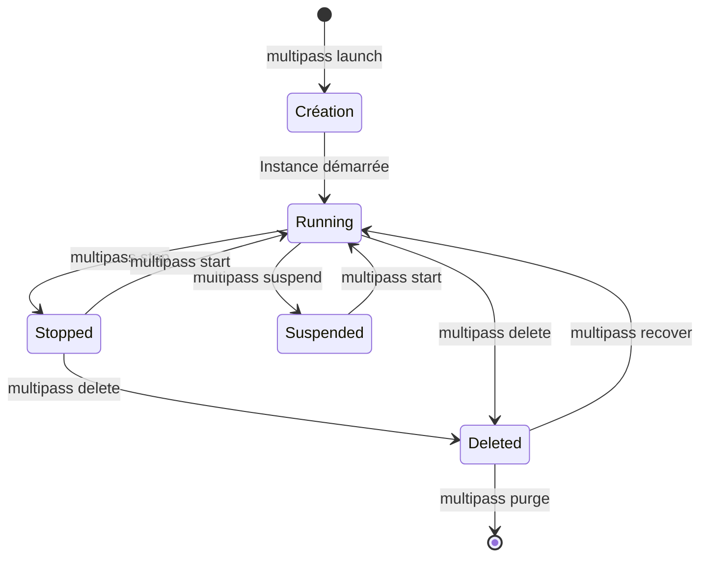
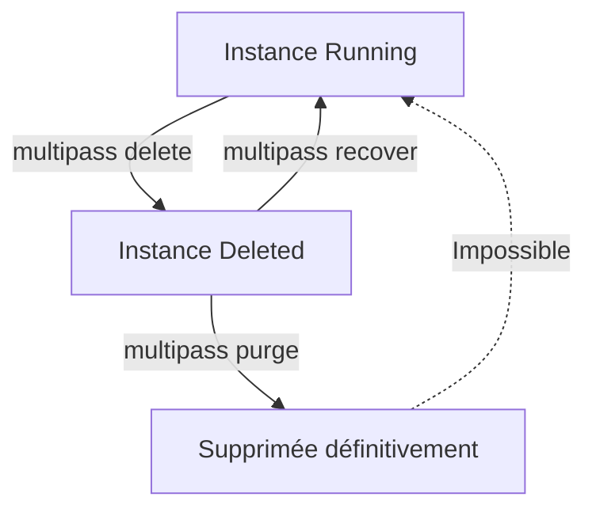

# Module 3 -- Gestion du cycle de vie des VM

## Introduction

Maintenant que Multipass est installé et opérationnel, il est temps
de passer aux choses sérieuses : créer, configurer et gérer vos
machines virtuelles. Pensez au cycle de vie d'une VM comme à celui
d'une voiture de location : vous la réservez (création), vous la
prenez (démarrage), vous la garez temporairement (suspension), vous
la rendez (arrêt), et parfois vous décidez de ne plus la reprendre
(suppression). Chaque étape a sa commande, et maîtriser ce cycle de
vie est la base de tout travail avec Multipass.

Ce module est le coeur de votre apprentissage : toutes les opérations
que vous réaliserez dans les modules suivants reposeront sur les
commandes que nous allons voir ici.

## Objectifs du module

Au terme de ce module vous serez capable de :

- Créer des instances Multipass avec des ressources personnalisées
- Choisir l'image Ubuntu adaptée à vos besoins
- Gérer le cycle de vie complet d'une instance (démarrer, arrêter,
  suspendre, supprimer)
- Consulter l'état et les informations détaillées de vos instances

## Créer une instance

### La commande `multipass launch`

Créer une machine virtuelle, c'est comme commander un plat au
restaurant : vous pouvez prendre le menu du jour (la configuration
par défaut) ou composer votre assiette à la carte (personnaliser les
ressources). La commande `multipass launch` est votre point d'entrée
pour les deux approches.

Dans sa forme la plus simple, `multipass launch` crée une VM avec
les paramètres par défaut :

```bash
# Créer une VM avec les paramètres par défaut
multipass launch --name ma-premiere-vm
```

Cette commande crée une instance nommée `ma-premiere-vm` avec la
dernière version LTS d'Ubuntu, 1 CPU, 1 Go de RAM et 5 Go de
disque. Le nom est important : c'est par ce nom que vous
référencerez cette instance dans toutes les commandes suivantes.

Si vous ne spécifiez pas de nom, Multipass en génère un
automatiquement (souvent un mot anglais aléatoire comme
`breezy-lemur` ou `calm-otter`).



### Choisir une image

Multipass propose plusieurs images Ubuntu. Pour voir lesquelles sont
disponibles :

```bash
# Lister toutes les images disponibles
multipass find
```

Le résultat affiche les versions Ubuntu avec leurs aliases :

```
Image           Aliases          Version
20.04           focal            20240822
22.04           jammy            20240829
24.04           noble,lts        20240830
```

Vous pouvez spécifier l'image souhaitée lors de la création :

```bash
# Créer une VM avec Ubuntu 22.04
multipass launch 22.04 --name vm-jammy

# Ou en utilisant l'alias
multipass launch jammy --name vm-jammy

# Créer une VM avec la dernière LTS
multipass launch lts --name vm-lts
```

#### Exemple pratique {id="exemple-choix-image"}

Imaginons que vous devez tester la compatibilité de votre
application avec Ubuntu 22.04 et 24.04 simultanément :

```bash
# Créer deux VM avec des versions différentes
multipass launch 22.04 --name app-test-jammy
multipass launch 24.04 --name app-test-noble

# Vérifier que les deux sont en fonctionnement
multipass list
```

Vous disposez alors de deux environnements de test indépendants,
chacun avec sa propre version d'Ubuntu.

### Personnaliser les ressources

La configuration par défaut (1 CPU, 1 Go de RAM, 5 Go de disque)
convient pour des tâches légères. Mais si vous prévoyez d'installer
Docker, de compiler du code ou de faire tourner une base de données,
il faudra allouer davantage de ressources.

```bash
# Créer une VM avec des ressources personnalisées
multipass launch --name dev-server \
  --cpus 2 \
  --memory 4G \
  --disk 20G
```

Les paramètres disponibles sont :

| Paramètre | Description | Défaut | Exemples |
|---|---|---|---|
| `--cpus` | Nombre de processeurs | 1 | `--cpus 2`, `--cpus 4` |
| `--memory` | Mémoire vive | 1G | `--memory 2G`, `--memory 512M` |
| `--disk` | Taille du disque | 5G | `--disk 10G`, `--disk 50G` |
| `--name` | Nom de l'instance | Aléatoire | `--name mon-serveur` |

<tip>

Dimensionnez vos instances en fonction de l'usage prévu. Pour un
serveur web simple, 1 CPU et 1 Go de RAM suffisent. Pour Docker,
prévoyez au moins 2 CPU et 2 Go de RAM. Pour une base de données,
4 Go de RAM est un minimum confortable.
</tip>

#### Exemple pratique {id="exemple-ressources"}

Voici quelques configurations types selon l'usage :

```bash
# VM légère pour des tests rapides
multipass launch --name test-leger \
  --cpus 1 --memory 512M --disk 5G

# VM pour le développement web
multipass launch --name dev-web \
  --cpus 2 --memory 2G --disk 15G

# VM pour Docker et conteneurs
multipass launch --name docker-host \
  --cpus 2 --memory 4G --disk 30G

# VM pour base de données
multipass launch --name db-server \
  --cpus 4 --memory 8G --disk 50G
```

## Gérer le cycle de vie des instances

### Lister les instances

Pour voir toutes vos instances et leur état actuel :

```bash
multipass list
```

La sortie ressemble à ceci :

```
Name          State       IPv4            Image
dev-server    Running     172.23.123.45   Ubuntu 24.04 LTS
test-leger    Stopped     --              Ubuntu 24.04 LTS
docker-host   Suspended   --              Ubuntu 24.04 LTS
old-vm        Deleted     --              Ubuntu 22.04 LTS
```

Les quatre états possibles sont :

- **Running** : la VM est en fonctionnement
- **Stopped** : la VM est arrêtée proprement
- **Suspended** : la VM est en pause (état sauvegardé en mémoire)
- **Deleted** : la VM est marquée pour suppression mais récupérable

### Démarrer et arrêter

Démarrer et arrêter une instance est aussi simple que d'allumer et
éteindre un ordinateur :

```bash
# Arrêter une instance
multipass stop dev-server

# Démarrer une instance
multipass start dev-server

# Arrêter toutes les instances
multipass stop --all

# Démarrer toutes les instances
multipass start --all
```

La différence entre `stop` et `suspend` est importante. `stop`
éteint proprement la VM (équivalent à un arrêt du système), tandis
que `suspend` met la VM en hibernation (l'état de la mémoire est
sauvegardé sur le disque). La reprise après un `suspend` est plus
rapide, car le système n'a pas besoin de redémarrer complètement.

```bash
# Suspendre une instance (reprise rapide)
multipass suspend dev-server

# La reprendre
multipass start dev-server
```

### Consulter les informations détaillées

La commande `multipass info` affiche les détails d'une instance :

```bash
multipass info dev-server
```

La sortie fournit des informations précieuses :

```
Name:           dev-server
State:          Running
IPv4:           172.23.123.45
Release:        Ubuntu 24.04 LTS
Image hash:     a1b2c3d4 (Ubuntu 24.04 LTS)
CPU(s):         2
Load:           0.08 0.03 0.01
Disk usage:     1.5G out of 20.0G
Memory usage:   256.7M out of 4.0G
Mounts:         --
```

#### Exemple pratique {id="exemple-info"}

Vous pouvez utiliser `multipass info` dans des scripts pour
extraire des informations spécifiques, comme l'adresse IP :

```bash
# Obtenir uniquement l'adresse IP
multipass info dev-server | grep IPv4

# Afficher les infos de toutes les instances
multipass info --all
```

L'adresse IP est particulièrement utile pour accéder aux services
qui tournent dans la VM (serveur web, base de données, etc.) depuis
votre machine hôte.

## Supprimer et purger

### La suppression en deux temps

Multipass adopte une approche prudente pour la suppression : elle
se fait en deux étapes, comme une corbeille. Quand vous supprimez
une instance avec `multipass delete`, elle est marquée comme
supprimée mais reste récupérable. C'est seulement avec
`multipass purge` que l'instance est définitivement effacée du
disque.

```bash
# Marquer une instance pour suppression
multipass delete test-leger

# L'instance apparaît comme "Deleted" dans la liste
multipass list

# Récupérer une instance supprimée (avant purge)
multipass recover test-leger

# Supprimer définitivement toutes les instances "Deleted"
multipass purge
```

<warning>

La commande `multipass purge` est irréversible. Une fois exécutée,
les instances supprimées ne peuvent plus être récupérées.
Vérifiez toujours avec `multipass list` avant de purger.
</warning>

#### Exemple pratique {id="exemple-nettoyage"}

Voici un scénario typique de nettoyage après une session de travail :

```bash
# Voir l'état de toutes les instances
multipass list

# Arrêter les instances dont on n'a plus besoin
multipass stop test-leger old-vm

# Supprimer les instances temporaires
multipass delete test-leger old-vm

# Vérifier avant de purger
multipass list

# Purger définitivement
multipass purge

# Vérifier le résultat final
multipass list
```



## Conclusion

Ce module vous a donné les clés pour gérer l'ensemble du cycle de
vie de vos machines virtuelles Multipass. Vous savez créer une
instance avec `multipass launch`, choisir l'image et les ressources
adaptées, gérer les différents états (running, stopped, suspended,
deleted) et consulter les informations détaillées de chaque instance.

Le point essentiel à retenir est la logique en deux temps de la
suppression : `delete` place l'instance dans une corbeille
récupérable, tandis que `purge` efface définitivement. Cette
approche prudente vous protège contre les suppressions accidentelles.

Dans le prochain module, nous verrons comment accéder à vos instances
et travailler efficacement à l'intérieur.
