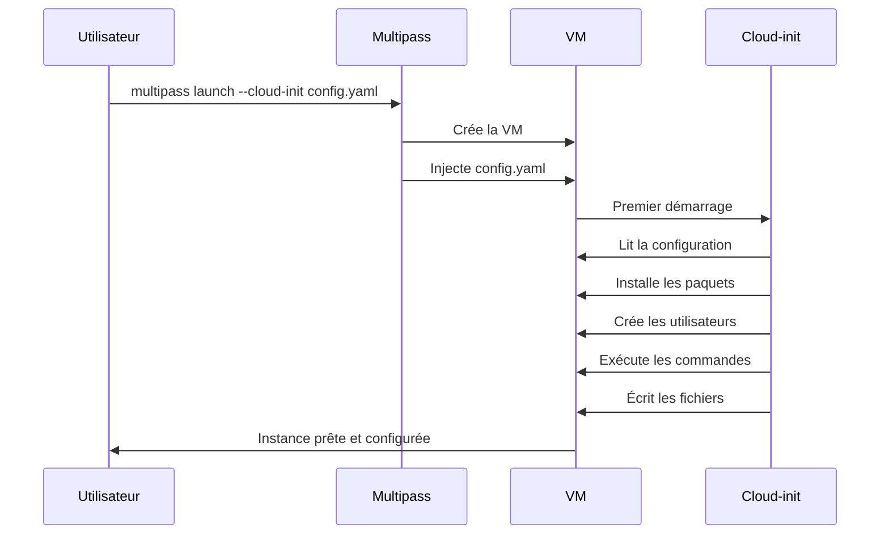

# Module 5 -- Provisioning avec cloud-init

## Introduction

Jusqu'ici, chaque fois que nous avons voulu configurer une instance,
nous avons dû nous y connecter manuellement et exécuter des commandes
une par une. C'est tout à fait fonctionnel pour une ou deux VM, mais
imaginez devoir configurer dix instances identiques : installer les
mêmes paquets, créer les mêmes utilisateurs, appliquer la même
configuration. Le faire à la main serait fastidieux et source
d'erreurs.

Pensez à la différence entre cuisiner un plat en improvisant et
suivre une recette écrite. La recette garantit un résultat
reproductible à chaque fois, quel que soit le cuisinier. Cloud-init
est cette recette pour vos machines virtuelles : vous décrivez dans
un fichier YAML ce que vous voulez, et cloud-init se charge de tout
appliquer automatiquement au premier démarrage de l'instance.

C'est le principe de l'"infrastructure as code" : au lieu de
configurer manuellement, vous décrivez la configuration dans un
fichier versionnable, partageable et reproductible.

## Objectifs du module

Au terme de ce module vous serez capable de :

- Expliquer le rôle de cloud-init et son intérêt pour
  l'automatisation
- Rédiger un fichier cloud-config YAML avec les directives
  principales
- Créer une instance Multipass provisionnée automatiquement
  par cloud-init
- Valider un fichier cloud-init avant de l'utiliser

## Qu'est-ce que cloud-init ?

### Le standard de l'initialisation cloud

Avez-vous déjà configuré un nouveau téléphone en restaurant une
sauvegarde ? En quelques minutes, toutes vos applications, vos
contacts et vos paramètres sont restaurés automatiquement. Cloud-init
fait la même chose pour les machines virtuelles et les instances
cloud.

Cloud-init est un outil développé par Canonical et devenu un standard
de l'industrie. Il est intégré dans la plupart des images cloud
(Ubuntu, Debian, CentOS, etc.) et est utilisé par tous les grands
fournisseurs cloud (AWS, Azure, GCP). Quand une instance démarre
pour la première fois, cloud-init lit un fichier de configuration et
exécute les instructions qu'il contient : installation de paquets,
création d'utilisateurs, écriture de fichiers, exécution de
commandes.



L'intérêt majeur de cloud-init est la reproductibilité. Vous écrivez
votre configuration une fois, et vous pouvez la réutiliser pour
créer autant d'instances identiques que nécessaire. Le fichier YAML
peut être versionné dans Git, partagé entre collègues et documenté.

## Structure d'un fichier cloud-config

### Les directives principales

Un fichier cloud-config est un fichier YAML qui commence
obligatoirement par la ligne `#cloud-config`. Cette ligne est un
marqueur qui indique à cloud-init qu'il s'agit bien d'un fichier
de configuration valide.

Voici les directives les plus utilisées :

```yaml
#cloud-config

# Installer des paquets système
packages:
  - git
  - curl
  - wget
  - htop

# Mettre à jour les paquets existants
package_update: true
package_upgrade: true

# Créer des utilisateurs
users:
  - name: developpeur
    groups: sudo
    shell: /bin/bash
    sudo: ALL=(ALL) NOPASSWD:ALL

# Écrire des fichiers
write_files:
  - path: /home/ubuntu/bienvenue.txt
    content: |
      Bienvenue sur cette instance !
      Configurée automatiquement par cloud-init.
    owner: ubuntu:ubuntu
    permissions: "0644"

# Exécuter des commandes au premier démarrage
runcmd:
  - echo "Configuration terminée" >> /var/log/cloud-init-custom.log
  - systemctl enable nginx
  - systemctl start nginx
```

Détaillons chaque directive :

<deflist>
<def title="packages">
Liste des paquets à installer via le gestionnaire de paquets du
système (apt sous Ubuntu). Les paquets sont installés dans l'ordre
de la liste.
</def>
<def title="package_update / package_upgrade">
`package_update` exécute `apt update` pour rafraîchir la liste des
paquets. `package_upgrade` exécute `apt upgrade` pour mettre à jour
les paquets existants.
</def>
<def title="users">
Permet de créer des utilisateurs système. Chaque utilisateur peut
avoir des groupes, un shell et des droits sudo configurés.
</def>
<def title="write_files">
Crée des fichiers sur le système avec un contenu, un propriétaire
et des permissions spécifiques. Idéal pour déposer des fichiers de
configuration.
</def>
<def title="runcmd">
Liste de commandes à exécuter une seule fois, lors du premier
démarrage. Les commandes sont exécutées en tant que root.
</def>
</deflist>

#### Exemple pratique {id="exemple-cloud-config-basique"}

Voici un fichier cloud-config minimal; mais fonctionnel qui installe
un serveur web Nginx et crée une page d'accueil personnalisée :

```yaml
#cloud-config

package_update: true

packages:
  - nginx

write_files:
  - path: /var/www/html/index.html
    content: |
      <!DOCTYPE html>
      <html>
      <head><title>Ma VM Multipass</title></head>
      <body>
        <h1>Serveur configuré par cloud-init</h1>
        <p>Cette page prouve que tout fonctionne.</p>
      </body>
      </html>
    owner: www-data:www-data
    permissions: "0644"

runcmd:
  - systemctl enable nginx
  - systemctl start nginx
```

## Lancer une VM avec cloud-init

### La syntaxe de lancement

Pour utiliser un fichier cloud-init lors de la création d'une
instance, il suffit d'ajouter l'option `--cloud-init` à la commande
`multipass launch` :

```bash
# Lancer une VM avec cloud-init
multipass launch --name web-server \
  --cpus 2 --memory 2G --disk 10G \
  --cloud-init config.yaml
```

Multipass transmet le fichier YAML à cloud-init, qui l'exécute
automatiquement au premier démarrage de l'instance. Le processus
peut prendre quelques minutes selon le nombre de paquets à installer
et de commandes à exécuter.

<note>

Cloud-init ne s'exécute qu'au premier démarrage de l'instance.
Si vous arrêtez puis redémarrez la VM, cloud-init ne se relancera
pas. Pour appliquer une nouvelle configuration, il faut créer une
nouvelle instance.
</note>

#### Exemple pratique {id="exemple-lancement-cloudinit"}

Créons un environnement de développement complet avec cloud-init.
D'abord, écrivez le fichier de configuration :

```yaml
#cloud-config

package_update: true
package_upgrade: true

packages:
  - git
  - curl
  - wget
  - build-essential
  - python3
  - python3-pip
  - python3-venv
  - nginx
  - htop

write_files:
  - path: /home/ubuntu/.bashrc.d/aliases.sh
    content: |
      # Aliases personnalisés
      alias ll='ls -alF'
      alias la='ls -A'
      alias gs='git status'
      alias gp='git pull'
    owner: ubuntu:ubuntu
    permissions: "0644"

  - path: /home/ubuntu/README.md
    content: |
      # Environnement de développement
      ## Outils installés
      - Git, curl, wget
      - Python 3 avec pip et venv
      - Nginx
      - Build essentials (gcc, make, etc.)
    owner: ubuntu:ubuntu
    permissions: "0644"

runcmd:
  - mkdir -p /home/ubuntu/.bashrc.d
  - |
    echo 'for f in ~/.bashrc.d/*.sh; do
      [ -r "$f" ] && . "$f"
    done' >> /home/ubuntu/.bashrc
  - chown -R ubuntu:ubuntu /home/ubuntu/.bashrc.d
  - systemctl enable nginx
```

Puis lancez l'instance :

```bash
# Créer l'instance avec la configuration
multipass launch --name dev-env \
  --cpus 2 --memory 4G --disk 20G \
  --cloud-init dev-env-config.yaml

# Vérifier que tout est installé
multipass exec dev-env -- git --version
multipass exec dev-env -- python3 --version
multipass exec dev-env -- nginx -v
```

## Exemples pratiques avancés

### Installation automatique de paquets et configuration réseau

Voici un fichier cloud-init plus élaboré qui configure une instance
avec des règles réseau et des outils de diagnostic :

```yaml
#cloud-config

package_update: true

packages:
  - net-tools
  - traceroute
  - nmap
  - tcpdump
  - iperf3

write_files:
  - path: /etc/sysctl.d/99-custom.conf
    content: |
      # Activer le forwarding IP
      net.ipv4.ip_forward=1
    permissions: "0644"

runcmd:
  - sysctl -p /etc/sysctl.d/99-custom.conf
  - echo "Configuration réseau appliquée"
```

### Création d'utilisateurs multiples

```yaml
#cloud-config

users:
  - default
  - name: alice
    groups: sudo, docker
    shell: /bin/bash
    sudo: ALL=(ALL) NOPASSWD:ALL
    ssh_authorized_keys:
      - ssh-rsa AAAA...votre-clé-publique...
  - name: bob
    groups: docker
    shell: /bin/bash

write_files:
  - path: /etc/motd
    content: |
      ==========================================
      Instance de développement - Équipe Alpha
      Utilisateurs : alice (admin), bob (dev)
      ==========================================
    permissions: "0644"
```

<tip>

La directive `- default` dans la section `users` conserve
l'utilisateur `ubuntu` par défaut. Sans cette ligne, l'utilisateur
`ubuntu` ne serait pas créé et vous ne pourriez plus vous connecter
via `multipass shell`.
</tip>

## Validation d'un fichier cloud-init

### Vérifier avant de lancer

Un fichier YAML mal formaté peut provoquer des erreurs silencieuses.
Il est fortement recommandé de valider votre fichier cloud-init
avant de l'utiliser. Deux approches sont possibles.

**Validation depuis une instance existante** :

```bash
# Se connecter à une instance existante
multipass shell dev-server

# Valider le fichier cloud-init
cloud-init schema --config-file config.yaml
```

**Validation de la syntaxe YAML** depuis votre machine hôte avec
Python :

```bash
python3 -c "
import yaml, sys
try:
    with open(sys.argv[1]) as f:
        yaml.safe_load(f)
    print('Syntaxe YAML valide')
except yaml.YAMLError as e:
    print(f'Erreur YAML : {e}')
" config.yaml
```

#### Exemple pratique {id="exemple-validation"}

Voici un fichier cloud-init avec une erreur courante et comment la
détecter :

```yaml
#cloud-config

packages:
  - git
  - curl
write_files:
  - path: /home/ubuntu/test.txt
  content: |
    Ceci est un test
```

Ce fichier contient une erreur d'indentation : `content` devrait
être aligné sous `path`. Le validateur vous signalera cette erreur
avant que vous ne perdiez du temps à créer une instance mal
configurée.

La version corrigée :

```yaml
#cloud-config

packages:
  - git
  - curl
write_files:
  - path: /home/ubuntu/test.txt
    content: |
      Ceci est un test
```

## Conclusion

Cloud-init transforme la façon dont vous créez et configurez vos
instances Multipass. Au lieu de répéter manuellement les mêmes
étapes de configuration, vous décrivez votre environnement dans un
fichier YAML et laissez cloud-init faire le travail. Vous avez
appris à utiliser les directives principales (`packages`, `users`,
`write_files`, `runcmd`), à lancer une instance provisionnée
automatiquement et à valider vos fichiers avant utilisation.

Cette approche d'infrastructure as code est une compétence
fondamentale dans le monde professionnel. Les mêmes principes
s'appliquent à des outils plus avancés comme Ansible, Terraform ou
Kubernetes. Maîtriser cloud-init avec Multipass est une excellente
porte d'entrée vers ces technologies.

Dans le prochain module, nous verrons comment échanger des fichiers
entre votre machine hôte et vos instances.
