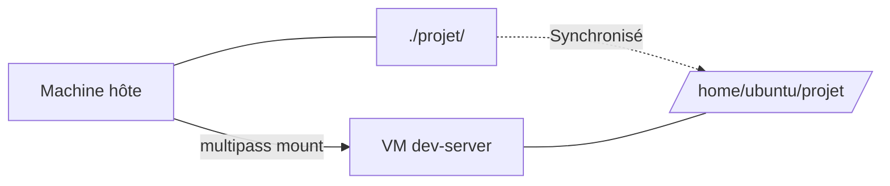

# Module 6 -- Transfert de fichiers entre hôte et VM

## Introduction

Vous savez maintenant créer des instances, vous y connecter et même
les configurer automatiquement. Mais dans un workflow de
développement réel, vous travaillez souvent sur votre machine hôte
(avec votre éditeur de code favori, vos outils graphiques, votre
environnement confortable) et vous avez besoin de déployer ou de
tester dans la VM. Il faut donc un moyen de faire transiter des
fichiers entre les deux mondes.

Pensez à un pont entre deux îles : votre machine hôte est une île,
votre VM en est une autre. Multipass vous propose deux types de
ponts. Le premier est un ferry (`multipass transfer`) : vous
chargez vos fichiers, vous les transportez d'un côté à l'autre, et
le transfert est terminé. Le second est un pont permanent
(`multipass mount`) : un dossier de votre machine hôte devient
directement accessible depuis la VM, comme s'il existait aux deux
endroits en même temps.

## Objectifs du module

Au terme de ce module vous serez capable de :

- Transférer des fichiers de l'hôte vers une instance et inversement
- Monter un dossier partagé entre l'hôte et une instance
- Choisir la méthode de partage adaptée à votre situation

## Transférer des fichiers avec `multipass transfer`

### De l'hôte vers la VM

La commande `multipass transfer` copie des fichiers d'un point à
un autre. Pour envoyer un fichier depuis votre machine hôte vers
une instance :

```bash
# Syntaxe générale
multipass transfer <fichier-local> <nom-instance>:<chemin>

# Exemple : envoyer un fichier dans le home de la VM
multipass transfer mon-script.sh dev-server:/home/ubuntu/

# Envoyer un fichier dans un autre répertoire spécifique
multipass transfer config.json \
  dev-server:/home/ubuntu/projet/config.json
```

Le format `<nom-instance>:<chemin>` est la convention utilisée par
Multipass pour désigner un emplacement dans une VM. C'est la même
logique que la commande `scp` si vous connaissez SSH.

#### Exemple pratique {id="exemple-transfer-vers-vm"}

Imaginons que vous avez développé un script Python sur votre machine
et que vous souhaitez le tester dans une VM :

```bash
# Créer un script de test sur la machine hôte
# (le fichier existe déjà dans votre répertoire de travail)

# Envoyer le script dans la VM
multipass transfer app.py dev-server:/home/ubuntu/

# Exécuter le script dans la VM
multipass exec dev-server -- python3 /home/ubuntu/app.py
```

### De la VM vers l'hôte

Le transfert fonctionne aussi dans l'autre sens. Pour récupérer un
fichier depuis la VM vers votre machine hôte :

```bash
# Syntaxe : source dans la VM, destination locale
multipass transfer \
  dev-server:/home/ubuntu/resultats.csv .

# Récupérer un fichier de log
multipass transfer \
  dev-server:/var/log/nginx/access.log ./logs/
```

Le point `.` à la fin indique le répertoire courant sur votre
machine hôte.

#### Exemple pratique {id="exemple-transfer-depuis-vm"}

Vous avez généré un rapport dans la VM et vous voulez le récupérer :

```bash
# Générer un rapport dans la VM
multipass exec dev-server -- bash -c "
  df -h > /home/ubuntu/rapport-disque.txt
  free -h >> /home/ubuntu/rapport-disque.txt
  uptime >> /home/ubuntu/rapport-disque.txt
"

# Récupérer le rapport
multipass transfer \
  dev-server:/home/ubuntu/rapport-disque.txt .

# Vérifier le contenu localement
cat rapport-disque.txt
```

### Transferts multiples

Vous pouvez transférer plusieurs fichiers en une seule commande :

```bash
# Envoyer plusieurs fichiers
multipass transfer fichier1.txt fichier2.txt \
  dev-server:/home/ubuntu/

# Récupérer plusieurs fichiers
multipass transfer \
  dev-server:/home/ubuntu/fichier1.txt \
  dev-server:/home/ubuntu/fichier2.txt .
```

<warning>

La commande `multipass transfer` ne gère pas nativement les
répertoires entiers. Pour transférer un dossier complet, vous
pouvez le compresser en archive (tar ou zip) avant le transfert,
ou utiliser le montage de dossier que nous verrons juste après.
</warning>

#### Exemple pratique {id="exemple-transfer-dossier"}

Voici comment contourner la limitation sur les répertoires en
utilisant une archive :

```bash
# Sur la machine hôte : compresser le dossier
tar czf mon-projet.tar.gz mon-projet/

# Envoyer l'archive
multipass transfer mon-projet.tar.gz \
  dev-server:/home/ubuntu/

# Décompresser dans la VM
multipass exec dev-server -- \
  tar xzf /home/ubuntu/mon-projet.tar.gz \
  -C /home/ubuntu/

# Vérifier
multipass exec dev-server -- ls /home/ubuntu/mon-projet/
```

## Montage de dossiers partagés

### La commande `multipass mount`

Le montage de dossier est l'alternative la plus pratique pour un
travail continu. Au lieu de copier des fichiers à chaque
modification, vous rendez un dossier de votre machine hôte
directement accessible depuis la VM. Toute modification faite d'un
côté est immédiatement visible de l'autre.

```bash
# Syntaxe générale
multipass mount <dossier-local> <nom-instance>:<point-montage>

# Exemple : monter le dossier "projet" dans la VM
multipass mount ./projet dev-server:/home/ubuntu/projet
```

Désormais, le dossier `./projet` de votre machine hôte et le
dossier `/home/ubuntu/projet` dans la VM pointent vers les mêmes
fichiers. Modifiez un fichier dans votre éditeur de code sur l'hôte,
et le changement est instantanément visible dans la VM.



#### Exemple pratique {id="exemple-mount"}

Voici un workflow de développement typique avec un dossier monté :

```bash
# Créer un dossier de projet sur l'hôte
mkdir -p ~/projets/mon-app
cd ~/projets/mon-app

# Initialiser un projet
echo '{"name": "mon-app"}' > package.json

# Monter le dossier dans la VM
multipass mount ~/projets/mon-app \
  dev-server:/home/ubuntu/mon-app

# Vérifier que le montage fonctionne
multipass exec dev-server -- \
  cat /home/ubuntu/mon-app/package.json

# Maintenant, toute modification sur l'hôte est
# instantanément visible dans la VM et inversement
```

### Vérifier et démonter

Pour voir les montages actifs et les supprimer :

```bash
# Voir les montages actifs d'une instance
multipass info dev-server
# La section "Mounts" affiche les dossiers montés

# Démonter un dossier
multipass umount dev-server:/home/ubuntu/projet

# Démonter tous les montages d'une instance
multipass umount dev-server
```

### Transfer vs Mount : quel choix faire ?

| Critère | `transfer` | `mount` |
|---|---|---|
| Cas d'usage | Copie ponctuelle | Travail continu |
| Synchronisation | Non (copie unique) | Oui (temps réel) |
| Performance | Rapide pour petits fichiers | Variable |
| Répertoires | Non (archives) | Oui |
| Persistance | Copie indépendante | Liée au montage |

<tip>

Privilégiez `multipass mount` quand vous développez activement et
que vous voulez éditer sur l'hôte tout en testant dans la VM.
Utilisez `multipass transfer` pour des échanges ponctuels ou quand
vous voulez une copie indépendante du fichier.
</tip>

### Cas d'usage : partager un répertoire de projet

Voici un scénario complet qui illustre le partage d'un répertoire
de projet entre l'hôte et la VM :

```bash
# 1. Créer l'instance
multipass launch --name dev-web \
  --cpus 2 --memory 2G --disk 15G

# 2. Installer les outils dans la VM
multipass exec dev-web -- \
  sudo apt update -qq
multipass exec dev-web -- \
  sudo apt install -y -qq python3 python3-pip

# 3. Monter le dossier du projet
multipass mount ~/projets/webapp \
  dev-web:/home/ubuntu/webapp

# 4. Travailler : éditer sur l'hôte, tester dans la VM
# (Sur l'hôte, avec votre éditeur favori)
# code ~/projets/webapp/app.py

# (Dans la VM, lancer le serveur)
multipass exec dev-web -- bash -c "
  cd /home/ubuntu/webapp
  python3 app.py
"

# 5. Accéder au serveur depuis l'hôte
# (L'IP de la VM est accessible depuis l'hôte)
multipass info dev-web | grep IPv4
# Puis ouvrir http://<ip-vm>:5000 dans le navigateur
```

Ce workflow vous permet de bénéficier du meilleur des deux mondes :
le confort de votre éditeur de code sur l'hôte et l'environnement
d'exécution isolé de la VM.

## Conclusion

Ce module vous a présenté les deux méthodes de partage de fichiers
entre votre machine hôte et vos instances Multipass. La commande
`multipass transfer` effectue des copies ponctuelles dans les deux
sens, tandis que `multipass mount` crée un lien permanent entre un
dossier de l'hôte et un point de montage dans la VM.

Pour un workflow de développement quotidien, le montage de dossier
est généralement la solution la plus productive : vous éditez avec
vos outils habituels et testez dans la VM sans aucune étape de
copie intermédiaire.

Le prochain module abordera la communication réseau entre les
instances, ce qui vous permettra de créer des architectures
distribuées avec plusieurs VM qui collaborent.
