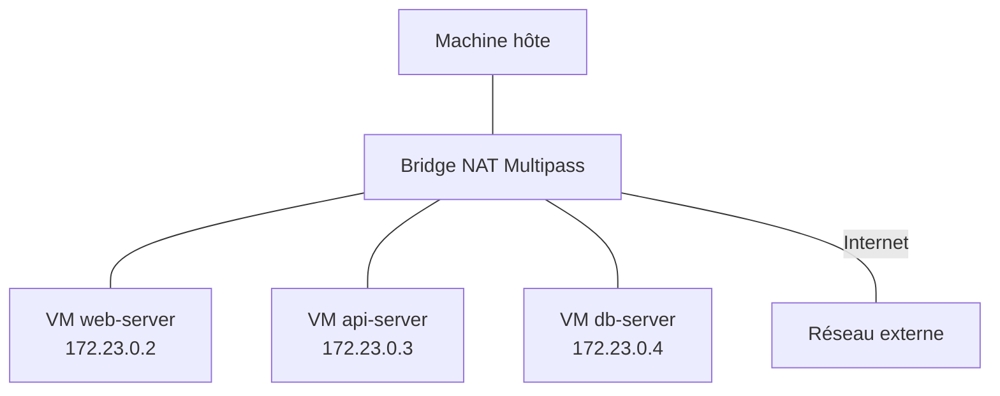
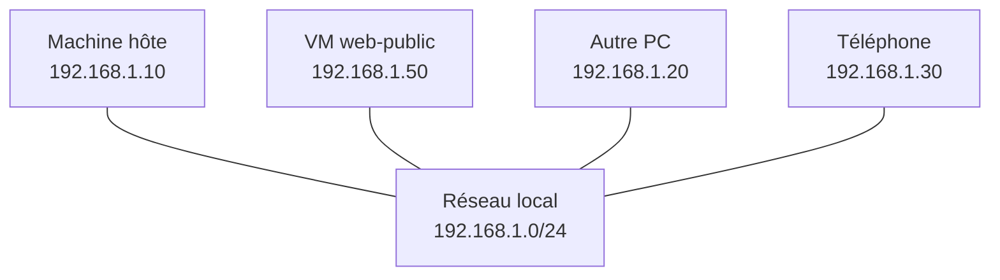
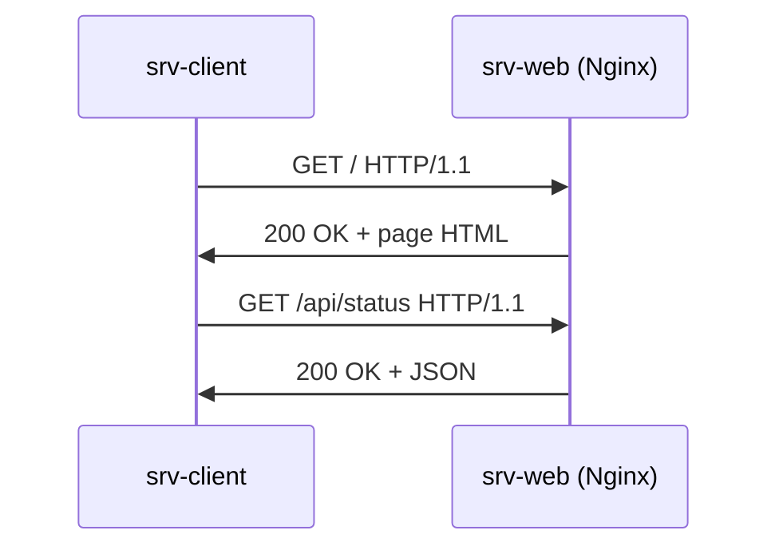

# Module 7 -- Communication réseau entre les VM

## Introduction

Jusqu'à présent, nous avons travaillé avec des instances isolées :
une VM à la fois, indépendante du reste. Mais dans la réalité
professionnelle, les applications modernes reposent rarement sur
une seule machine. Un serveur web communique avec un serveur de base
de données, une API échange des données avec un service
d'authentification, un front-end interroge un back-end. Simuler ces
architectures distribuées est l'un des grands atouts de Multipass.

Imaginez un immeuble d'appartements : chaque appartement (VM) est
indépendant, mais ils partagent tous le même couloir (réseau). Les
habitants peuvent se rendre visite, échanger du courrier ou partager
des ressources communes. Le réseau de Multipass fonctionne de la
même manière : toutes vos instances partagent un réseau commun et
peuvent communiquer entre elles.

## Objectifs du module

Au terme de ce module vous serez capable de :

- Comprendre le réseau par défaut de Multipass et son fonctionnement
- Identifier les adresses IP de vos instances
- Tester la connectivité entre plusieurs VM
- Configurer un réseau bridgé pour exposer les VM sur le réseau local
- Mettre en place une communication client/serveur entre instances

## Réseau par défaut de Multipass

### Le bridge NAT

Par défaut, Multipass crée un réseau virtuel privé de type NAT
(Network Address Translation) entre toutes les instances et la
machine hôte. Ce réseau fonctionne comme un routeur domestique :
les VM obtiennent une adresse IP dans une plage privée et peuvent
communiquer entre elles ainsi qu'avec l'hôte.



Les caractéristiques de ce réseau par défaut sont :

- Les VM obtiennent une adresse IP automatiquement via DHCP
- Toutes les VM peuvent communiquer entre elles
- Les VM peuvent accéder à Internet
- L'hôte peut accéder aux VM via leurs adresses IP
- Les machines du réseau local ne peuvent pas accéder aux VM
  (isolation par NAT)

### Identifier les adresses IP

Pour connaître l'adresse IP d'une instance, deux commandes sont
disponibles :

```bash
# Méthode 1 : via multipass list
multipass list
```

La sortie affiche l'IP de chaque instance en fonctionnement :

```
Name          State       IPv4            Image
web-server    Running     172.23.0.2      Ubuntu 24.04 LTS
api-server    Running     172.23.0.3      Ubuntu 24.04 LTS
db-server     Running     172.23.0.4      Ubuntu 24.04 LTS
```

```bash
# Méthode 2 : via multipass info (plus détaillé)
multipass info web-server
```

Vous pouvez aussi interroger la VM directement :

```bash
# Depuis la VM elle-même
multipass exec web-server -- hostname -I
```

#### Exemple pratique {id="exemple-identifier-ip"}

Voici comment créer deux instances et noter leurs adresses IP :

```bash
# Créer deux instances
multipass launch --name serveur-a
multipass launch --name serveur-b

# Afficher les adresses IP
multipass list

# Stocker les IP dans des variables (utile pour les scripts)
IP_A=$(multipass info serveur-a \
  | grep IPv4 | awk '{print $2}')
IP_B=$(multipass info serveur-b \
  | grep IPv4 | awk '{print $2}')
echo "Serveur A : $IP_A"
echo "Serveur B : $IP_B"
```

## Tester la connectivité entre VM

### Utiliser ping, curl et netcat

Une fois que vous connaissez les adresses IP de vos instances, vous
pouvez tester la connectivité entre elles. Trois outils sont
particulièrement utiles pour cela.

**ping** teste la connectivité de base entre deux machines :

```bash
# Depuis serveur-a, pinger serveur-b
multipass exec serveur-a -- ping -c 3 172.23.0.3
```

Si le ping réussit, les deux VM peuvent communiquer au niveau
réseau. Si le ping échoue, vérifiez que les deux instances sont
bien en état "Running".

**curl** teste la connectivité au niveau applicatif (HTTP) :

```bash
# Installer nginx sur serveur-b
multipass exec serveur-b -- \
  sudo apt install -y -qq nginx

# Depuis serveur-a, accéder au serveur web de serveur-b
multipass exec serveur-a -- curl http://172.23.0.3
```

**netcat** (nc) est un couteau suisse du réseau qui permet de tester
n'importe quel port :

```bash
# Sur serveur-b : écouter sur le port 8080
multipass exec serveur-b -- \
  bash -c "echo 'Bonjour depuis B' | nc -l 8080" &

# Depuis serveur-a : se connecter au port 8080 de serveur-b
multipass exec serveur-a -- nc 172.23.0.3 8080
```

#### Exemple pratique {id="exemple-connectivite"}

Voici un test de connectivité complet entre deux instances :

```bash
# Installer les outils de diagnostic
multipass exec serveur-a -- \
  sudo apt install -y -qq iputils-ping curl netcat-openbsd

# Test 1 : Ping
echo "--- Test ping ---"
multipass exec serveur-a -- ping -c 2 172.23.0.3

# Test 2 : Curl (si nginx est installé sur serveur-b)
echo "--- Test HTTP ---"
multipass exec serveur-a -- curl -s http://172.23.0.3

# Test 3 : Vérification de port ouvert
echo "--- Test port 22 (SSH) ---"
multipass exec serveur-a -- \
  bash -c "nc -z -w2 172.23.0.3 22 && \
  echo 'Port 22 ouvert' || echo 'Port 22 fermé'"
```

## Configuration d'un réseau bridgé

### Exposer les VM sur le réseau local

Le réseau NAT par défaut isole vos VM du réseau local. C'est
généralement une bonne chose pour la sécurité, mais parfois vous
avez besoin que d'autres machines de votre réseau puissent accéder
à une VM (par exemple pour montrer votre travail à un collègue ou
pour tester depuis un autre appareil).

Le réseau bridgé résout ce problème en connectant la VM directement
à votre réseau local. La VM obtient alors une adresse IP sur le
même sous-réseau que votre machine hôte, comme si c'était une
machine physique supplémentaire sur le réseau.

```bash
# Lancer une instance avec une interface réseau bridgée
multipass launch --name web-public \
  --network name=en0,mode=auto
```

<note>

Le nom de l'interface réseau (`en0`, `eth0`, `Wi-Fi`, etc.) dépend
de votre système d'exploitation et de votre configuration réseau.
Consultez la documentation de Multipass pour connaître la syntaxe
exacte sur votre plateforme.
</note>

Pour lister les réseaux disponibles pour le bridge :

```bash
multipass networks
```



Avec un réseau bridgé, le téléphone, l'autre PC et la machine hôte
peuvent tous accéder directement à la VM via son adresse IP locale
(192.168.1.50 dans cet exemple).

## Cas pratique : communication client/serveur

### Mise en place d'une architecture à deux VM

Mettons en pratique tout ce que nous avons vu en créant une
architecture simple : un serveur web (qui répond aux requêtes HTTP)
et un client (qui interroge le serveur). Ce type d'architecture est
à la base de toutes les applications web modernes.

```bash
# Créer les deux instances
multipass launch --name srv-web \
  --cpus 1 --memory 1G
multipass launch --name srv-client \
  --cpus 1 --memory 1G
```

**Configurer le serveur** :

```bash
# Installer et configurer Nginx sur le serveur
multipass exec srv-web -- sudo apt update -qq
multipass exec srv-web -- \
  sudo apt install -y -qq nginx

# Créer une page de test
multipass exec srv-web -- sudo bash -c "
cat > /var/www/html/index.html << 'EOF'
<!DOCTYPE html>
<html>
<head><title>Serveur Multipass</title></head>
<body>
  <h1>Réponse du serveur</h1>
  <p>Ce serveur tourne dans une VM Multipass.</p>
</body>
</html>
EOF
"

# Vérifier que Nginx tourne
multipass exec srv-web -- \
  systemctl status nginx --no-pager
```

**Tester depuis le client** :

```bash
# Installer curl sur le client
multipass exec srv-client -- \
  sudo apt install -y -qq curl

# Récupérer l'IP du serveur
SRV_IP=$(multipass info srv-web \
  | grep IPv4 | awk '{print $2}')

# Faire une requête HTTP du client vers le serveur
multipass exec srv-client -- curl http://$SRV_IP

# Tester depuis la machine hôte également
curl http://$SRV_IP
```

**Tester depuis la machine hôte** :

```bash
# L'hôte peut aussi accéder au serveur web
# via l'adresse IP de la VM
curl http://$(multipass info srv-web \
  | grep IPv4 | awk '{print $2}')
```



Ce schéma illustre le flux de communication entre les deux VM :
le client envoie des requêtes HTTP, le serveur répond avec le
contenu demandé. C'est exactement le même mécanisme que celui
utilisé par votre navigateur quand vous visitez un site web.

## Conclusion

Ce module vous a montré comment les instances Multipass communiquent
entre elles via le réseau NAT par défaut. Vous savez identifier les
adresses IP de vos instances, tester la connectivité avec ping, curl
et netcat, et configurer un réseau bridgé quand vous avez besoin
d'exposer une VM sur le réseau local.

La capacité à créer des architectures multi-VM est un atout majeur
de Multipass. Elle vous permet de simuler des environnements
distribués réalistes directement sur votre poste de développement,
sans avoir besoin de serveurs physiques ou de services cloud.

Le module suivant tirera parti de ces compétences réseau en
introduisant Docker dans les instances Multipass, ouvrant la porte
à la conteneurisation.
