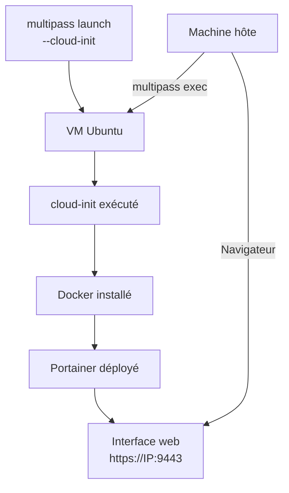

# Module 9 -- Multipass, Docker et Portainer

## Introduction

Vous savez maintenant utiliser Docker en ligne de commande dans vos
VM Multipass. C'est puissant, mais avouons-le : gérer des dizaines
de conteneurs, d'images et de volumes uniquement en CLI peut vite
devenir fastidieux. Et si vous pouviez tout piloter depuis une
interface web claire et intuitive, directement depuis votre
navigateur ?

Imaginez un tableau de bord dans un cockpit d'avion. Le pilote
pourrait théoriquement tout contrôler avec des commandes textuelles,
mais le tableau de bord lui offre une vue d'ensemble instantanée et
des commandes visuelles pour chaque système. Portainer joue
exactement ce rôle pour Docker : c'est une interface web qui vous
donne une vue complète de votre environnement Docker et vous permet
de le gérer sans taper une seule commande.

## Objectifs du module

Au terme de ce module vous serez capable de :

- Expliquer le rôle et l'intérêt de Portainer pour la gestion Docker
- Déployer Portainer dans une VM Multipass
- Accéder à l'interface Portainer depuis votre machine hôte
- Gérer des conteneurs, images et volumes via Portainer
- Automatiser le déploiement de Docker et Portainer avec cloud-init

## Présentation de Portainer

### Qu'est-ce que Portainer ?

Portainer est une plateforme de gestion de conteneurs open source
qui fournit une interface web pour Docker (et Kubernetes). La
version Community Edition (CE) est gratuite et largement suffisante
pour un usage de développement et d'apprentissage.

Portainer s'exécute lui-même en tant que conteneur Docker. C'est
une approche élégante : pour gérer Docker, on utilise Docker.
Portainer se connecte au socket Docker de la machine sur laquelle
il tourne et peut ainsi lister, créer, arrêter et supprimer des
conteneurs, gérer les images, les volumes et les réseaux.

Les fonctionnalités principales de Portainer sont :

- Visualisation de tous les conteneurs, images, volumes et réseaux
- Démarrage, arrêt et suppression de conteneurs en un clic
- Consultation des logs en temps réel
- Accès à un terminal dans un conteneur (équivalent de
  `docker exec -it`)
- Déploiement de stacks Docker Compose
- Gestion des utilisateurs et des droits d'accès

## Déploiement de Portainer

### Déployer Portainer dans une VM

Partons d'une VM avec Docker installé (voir le module précédent).
Le déploiement de Portainer se fait en une seule commande Docker :

```bash
# Se connecter à la VM Docker
multipass shell docker-auto

# Créer un volume pour la persistance des données
docker volume create portainer_data

# Lancer Portainer CE
docker run -d \
  --name portainer \
  --restart=always \
  -p 9443:9443 \
  -v /var/run/docker.sock:/var/run/docker.sock \
  -v portainer_data:/data \
  portainer/portainer-ce:latest
```

Analysons cette commande en détail :

<deflist>
<def title="-d">
Exécute le conteneur en arrière-plan (mode détaché).
</def>
<def title="--name portainer">
Nomme le conteneur pour le retrouver facilement.
</def>
<def title="--restart=always">
Redémarre automatiquement le conteneur si la VM redémarre ou
si le conteneur plante.
</def>
<def title="-p 9443:9443">
Expose le port 9443 de Portainer (interface web HTTPS).
</def>
<def title="-v /var/run/docker.sock:...">
Monte le socket Docker dans le conteneur. C'est ce qui permet à
Portainer de communiquer avec le daemon Docker de la VM.
</def>
<def title="-v portainer_data:/data">
Monte le volume de données pour que la configuration de Portainer
persiste entre les redémarrages.
</def>
</deflist>

#### Exemple pratique {id="exemple-deploiement-portainer"}

Voici la procédure complète depuis la création de la VM jusqu'à
Portainer fonctionnel :

```bash
# Créer une VM avec Docker (image optimisée)
multipass launch docker --name portainer-vm

# Vérifier que Docker est disponible
multipass exec portainer-vm -- docker version

# Déployer Portainer
multipass exec portainer-vm -- \
  docker volume create portainer_data

multipass exec portainer-vm -- \
  docker run -d \
  --name portainer \
  --restart=always \
  -p 9443:9443 \
  -v /var/run/docker.sock:/var/run/docker.sock \
  -v portainer_data:/data \
  portainer/portainer-ce:latest

# Vérifier que Portainer tourne
multipass exec portainer-vm -- docker ps
```

## Accéder à l'interface Portainer

### Connexion depuis la machine hôte

Portainer est maintenant accessible via un navigateur web. Pour y
accéder, vous avez besoin de l'adresse IP de la VM :

```bash
# Récupérer l'adresse IP de la VM
multipass info portainer-vm | grep IPv4
```

Ouvrez votre navigateur et accédez à :

```
https://<IP_DE_LA_VM>:9443
```

<note>
Portainer utilise un certificat SSL auto-signé. Votre navigateur
affichera un avertissement de sécurité. C'est normal dans un
contexte de développement local. Acceptez le certificat pour
continuer.
</note>

Lors de la première connexion, Portainer vous demande de créer un
compte administrateur :

<procedure>
<step>Choisissez un nom d'utilisateur (par défaut : admin)</step>
<step>Définissez un mot de passe (minimum 12 caractères)</step>
<step>Cliquez sur "Create user"</step>
<step>Sélectionnez "Get Started" pour configurer l'environnement local</step>
</procedure>

<warning>
Créez le compte administrateur dans les premières minutes après le
déploiement. Si vous attendez trop longtemps (plus de 5 minutes par
défaut), Portainer désactive l'interface d'initialisation par
sécurité et vous devrez redémarrer le conteneur.
</warning>

#### Exemple pratique {id="exemple-acces-portainer"}

Voici un script qui vous donne directement l'URL d'accès :

```bash
# Afficher l'URL de Portainer
IP=$(multipass info portainer-vm \
  | grep IPv4 | awk '{print $2}')
echo "Portainer est accessible à :"
echo "https://$IP:9443"
```

## Gérer Docker via Portainer

### Tableau de bord principal

Une fois connecté, le tableau de bord (Dashboard) de Portainer
affiche un résumé de votre environnement Docker :

- Nombre de conteneurs (en cours, arrêtés)
- Nombre d'images téléchargées
- Nombre de volumes
- Nombre de réseaux

### Gestion des conteneurs

Le menu "Containers" vous permet de voir tous les conteneurs et
d'agir sur chacun d'eux. Depuis cette interface, vous pouvez :

- Démarrer, arrêter, redémarrer ou supprimer un conteneur
- Voir les logs en temps réel
- Inspecter la configuration détaillée
- Ouvrir un terminal dans le conteneur
- Voir les statistiques de ressources (CPU, mémoire, réseau)

#### Exemple pratique {id="exemple-gestion-conteneurs"}

Créons quelques conteneurs via la ligne de commande, puis
gérons-les via Portainer :

```bash
# Créer plusieurs conteneurs pour la démonstration
multipass exec portainer-vm -- \
  docker run -d --name web1 -p 8081:80 nginx

multipass exec portainer-vm -- \
  docker run -d --name web2 -p 8082:80 nginx

multipass exec portainer-vm -- \
  docker run -d --name redis-cache redis:alpine
```

Rendez-vous ensuite dans Portainer (menu "Containers") pour voir
vos trois conteneurs. Vous pouvez cliquer sur chacun pour consulter
ses logs, ses statistiques, ou ouvrir un terminal interactif.

### Gestion des images

Le menu "Images" liste toutes les images Docker présentes sur la VM.
Vous pouvez :

- Voir la taille de chaque image
- Supprimer les images inutilisées
- Télécharger (pull) de nouvelles images directement depuis
  l'interface

### Gestion des volumes

Le menu "Volumes" affiche les volumes Docker. Les volumes sont le
mécanisme de persistance de Docker : les données stockées dans un
volume survivent à la suppression du conteneur.

```bash
# Créer un volume depuis la CLI pour illustration
multipass exec portainer-vm -- \
  docker volume create donnees-app
```

Ce volume apparaîtra ensuite dans l'interface Portainer où vous
pourrez le consulter et le gérer.

## Automatiser Docker et Portainer avec cloud-init

### La solution tout-en-un

Combiner cloud-init, Docker et Portainer permet de créer un
environnement complet de gestion de conteneurs en une seule
commande. Voici le fichier cloud-init qui réalise cette
automatisation :

```yaml
#cloud-config

package_update: true
package_upgrade: true

packages:
  - ca-certificates
  - curl
  - gnupg
  - lsb-release

runcmd:
  # Installer Docker
  - install -m 0755 -d /etc/apt/keyrings
  - |
    curl -fsSL \
      https://download.docker.com/linux/ubuntu/gpg \
      | gpg --dearmor \
      -o /etc/apt/keyrings/docker.gpg
  - chmod a+r /etc/apt/keyrings/docker.gpg
  - |
    echo "deb [arch=$(dpkg --print-architecture) \
      signed-by=/etc/apt/keyrings/docker.gpg] \
      https://download.docker.com/linux/ubuntu \
      $(. /etc/os-release && \
      echo $VERSION_CODENAME) stable" \
      | tee /etc/apt/sources.list.d/docker.list \
      > /dev/null
  - apt-get update
  - |
    apt-get install -y \
      docker-ce docker-ce-cli \
      containerd.io docker-compose-plugin

  # Configurer les permissions
  - usermod -aG docker ubuntu

  # Déployer Portainer
  - docker volume create portainer_data
  - |
    docker run -d \
      --name portainer \
      --restart=always \
      -p 9443:9443 \
      -v /var/run/docker.sock:/var/run/docker.sock \
      -v portainer_data:/data \
      portainer/portainer-ce:latest
```

Sauvegardez ce fichier sous `docker-portainer.yaml` et lancez
l'instance :

```bash
multipass launch --name full-stack \
  --cpus 2 --memory 4G --disk 30G \
  --cloud-init docker-portainer.yaml
```

#### Exemple pratique {id="exemple-full-stack"}

Voici comment vérifier que tout s'est bien déployé :

```bash
# Attendre la fin de cloud-init
multipass exec full-stack -- \
  cloud-init status --wait

# Vérifier Docker
multipass exec full-stack -- docker version

# Vérifier que Portainer tourne
multipass exec full-stack -- \
  docker ps --format \
  "table {{.Names}}\t{{.Status}}\t{{.Ports}}"

# Afficher l'URL d'accès
IP=$(multipass info full-stack \
  | grep IPv4 | awk '{print $2}')
echo "Portainer : https://$IP:9443"
```

En une seule commande `multipass launch`, vous obtenez une VM
complète avec Docker et Portainer prêts à l'emploi. Ce fichier
cloud-init est réutilisable et partageable avec votre équipe.



## Conclusion

Ce module a bouclé la boucle de notre exploration de Docker avec
Multipass. En ajoutant Portainer, vous disposez d'une interface web
complète pour gérer vos conteneurs sans quitter votre navigateur.
Vous avez appris à déployer Portainer, à y accéder depuis votre
machine hôte, et surtout à automatiser l'ensemble du déploiement
avec cloud-init.

L'enchaînement Multipass + Docker + Portainer constitue un
environnement de développement et d'expérimentation complet. Vous
pouvez le créer en une commande, le partager avec vos collègues via
un fichier YAML, et le détruire quand vous n'en avez plus besoin.

Le dernier module rassemblera toutes les bonnes pratiques et les
commandes essentielles pour travailler efficacement avec Multipass
au quotidien.
