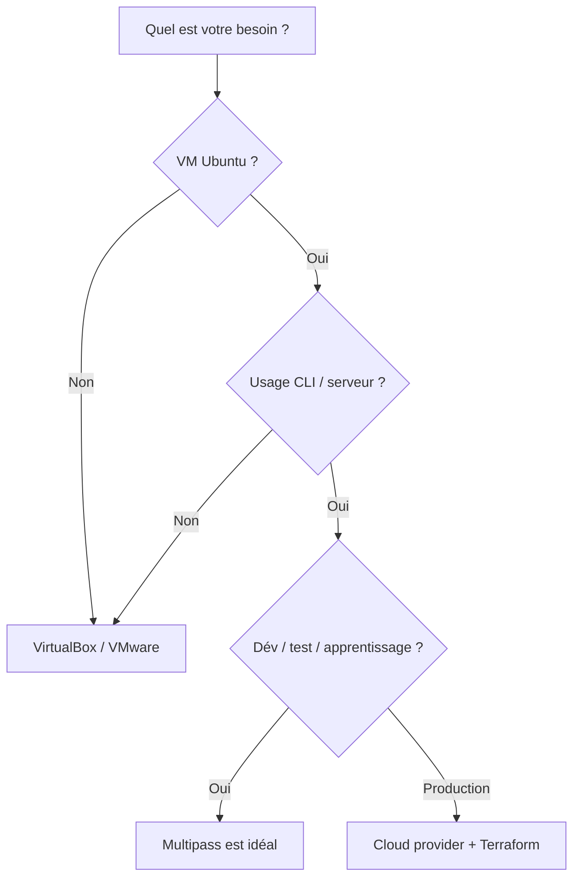

# Module 10 -- Bonnes pratiques et récapitulatif

## Introduction

Vous avez parcouru un long chemin depuis le premier module. Vous
savez installer Multipass, créer et gérer des VM, les configurer
automatiquement avec cloud-init, transférer des fichiers, faire
communiquer des instances entre elles, et même déployer Docker et
Portainer. Il est temps de prendre du recul et de consolider ces
connaissances avec les bonnes pratiques qui feront la différence
entre un usage amateur et un usage professionnel.

Pensez à un artisan qui maîtrise ses outils : ce qui le distingue
du débutant, ce n'est pas seulement sa capacité à utiliser chaque
outil individuellement, mais sa façon de les organiser, de les
entretenir et de choisir le bon outil pour la bonne tâche. Ce
module est consacré à cet art de l'organisation et de l'efficacité.

## Objectifs du module

Au terme de ce module vous serez capable de :

- Appliquer des stratégies de nommage et d'organisation cohérentes
- Surveiller et optimiser l'utilisation des ressources
- Maintenir un environnement Multipass propre et performant
- Identifier les limites de Multipass et savoir quand utiliser
  d'autres outils

## Tableau récapitulatif des commandes essentielles

### Aide-mémoire des commandes

Voici un récapitulatif de toutes les commandes que nous avons vues
au fil des modules, organisées par catégorie :

**Gestion du cycle de vie** :

| Commande | Description | Module |
|---|---|---|
| `multipass launch` | Créer une instance | 3 |
| `multipass launch --cloud-init` | Créer avec provisioning | 5 |
| `multipass start <nom>` | Démarrer une instance | 3 |
| `multipass stop <nom>` | Arrêter une instance | 3 |
| `multipass suspend <nom>` | Suspendre une instance | 3 |
| `multipass delete <nom>` | Marquer pour suppression | 3 |
| `multipass recover <nom>` | Récupérer une instance | 3 |
| `multipass purge` | Purger définitivement | 3 |

**Interaction et information** :

| Commande | Description | Module |
|---|---|---|
| `multipass shell <nom>` | Ouvrir un shell | 4 |
| `multipass exec <nom> -- cmd` | Exécuter une commande | 4 |
| `multipass list` | Lister les instances | 3 |
| `multipass info <nom>` | Détails d'une instance | 3 |
| `multipass find` | Images disponibles | 3 |
| `multipass version` | Version de Multipass | 2 |

**Fichiers et réseau** :

| Commande | Description | Module |
|---|---|---|
| `multipass transfer` | Copier des fichiers | 6 |
| `multipass mount` | Monter un dossier partagé | 6 |
| `multipass umount` | Démonter un dossier | 6 |
| `multipass networks` | Réseaux disponibles | 7 |

**Configuration** :

| Commande | Description | Module |
|---|---|---|
| `multipass get <clé>` | Lire un paramètre | 2 |
| `multipass set <clé>=<val>` | Modifier un paramètre | 2 |
| `multipass get --keys` | Lister les paramètres | 2 |

## Stratégies de nommage et d'organisation

### L'importance d'un nommage cohérent

Quand vous n'avez qu'une ou deux VM, le nommage importe peu. Mais
dès que vous commencez à travailler sur plusieurs projets
simultanément, un bon système de nommage devient indispensable.
Sans cela, vous vous retrouverez avec des instances aux noms
cryptiques sans savoir à quoi elles servent.

Voici quelques conventions de nommage éprouvées :

**Par projet et rôle** :

```bash
# Préfixe projet + rôle
multipass launch --name blog-web
multipass launch --name blog-db
multipass launch --name blog-cache

# Résultat de multipass list :
# blog-web     Running   172.23.0.2
# blog-db      Running   172.23.0.3
# blog-cache   Running   172.23.0.4
```

**Par environnement** :

```bash
# Préfixe environnement
multipass launch --name dev-api
multipass launch --name test-api
multipass launch --name staging-api
```

**Par date pour les instances temporaires** :

```bash
# Préfixe date pour les tests éphémères
multipass launch --name test-20240315-nginx
multipass launch --name test-20240315-redis
```

#### Exemple pratique {id="exemple-nommage"}

Voici comment organiser un projet complet avec un nommage cohérent :

```bash
# Projet "monapp" : architecture 3 tiers
multipass launch --name monapp-front \
  --cpus 1 --memory 1G

multipass launch --name monapp-api \
  --cpus 2 --memory 2G

multipass launch --name monapp-db \
  --cpus 2 --memory 4G --disk 30G

# Visualiser l'ensemble
multipass list
```

Le préfixe commun `monapp-` permet d'identifier immédiatement toutes
les instances liées au même projet. Le suffixe (`front`, `api`, `db`)
indique le rôle de chaque instance.

<tip>

Adoptez une convention de nommage dès le début de votre projet et
partagez-la avec votre équipe. Utilisez uniquement des minuscules,
des chiffres et des tirets. Évitez les espaces, les caractères
spéciaux et les noms génériques comme "test" ou "vm1".
</tip>

## Gestion des ressources

### Surveiller CPU, RAM et disque

Les ressources de votre machine hôte ne sont pas illimitées. Chaque
VM consomme du CPU, de la RAM et de l'espace disque. Il est
important de surveiller cette consommation pour éviter de saturer
votre système.

```bash
# Voir les ressources de toutes les instances
multipass info --all
```

Pour chaque instance, cette commande affiche la consommation en
CPU (charge), mémoire et disque. Voici comment interpréter les
résultats :

```bash
# Exemple de sortie pour une instance
# Load:        0.08 0.03 0.01    -> Charge CPU (1/5/15 min)
# Disk usage:  1.5G out of 20.0G -> 7.5% du disque utilisé
# Memory usage: 256M out of 4.0G -> 6.4% de la RAM utilisée
```

#### Exemple pratique {id="exemple-surveillance"}

Voici un petit script de surveillance pour toutes vos instances :

```bash
#!/bin/bash
# Script : check-resources.sh
# Affiche un résumé des ressources utilisées

echo "=== État des instances Multipass ==="
echo ""

for vm in $(multipass list --format csv \
  | tail -n +2 | cut -d, -f1); do

  STATE=$(multipass info "$vm" \
    | grep State | awk '{print $2}')

  if [ "$STATE" = "Running" ]; then
    DISK=$(multipass info "$vm" \
      | grep "Disk usage" \
      | awk '{print $3, $4, $5, $6}')
    MEM=$(multipass info "$vm" \
      | grep "Memory usage" \
      | awk '{print $3, $4, $5, $6}')
    echo "$vm : Disque=$DISK | RAM=$MEM"
  else
    echo "$vm : $STATE"
  fi
done
```

### Bonnes pratiques d'allocation

Quelques règles pour dimensionner vos instances efficacement :

- N'allouez que les ressources nécessaires. Une VM de test n'a pas
  besoin de 8 Go de RAM.
- Arrêtez les instances que vous n'utilisez pas activement.
  Une instance arrêtée ne consomme pas de CPU ni de RAM (mais
  occupe toujours de l'espace disque).
- Surveillez l'espace disque. Les images Docker et les volumes
  peuvent rapidement occuper des dizaines de gigaoctets.

## Nettoyage régulier

### Pourquoi et comment nettoyer

Au fil du temps, les instances s'accumulent : des tests oubliés,
des VM obsolètes, des expériences abandonnées. Un nettoyage régulier
est nécessaire pour libérer de l'espace disque et garder un
environnement clair.

```bash
# 1. Identifier les instances à nettoyer
multipass list

# 2. Arrêter les instances inutiles
multipass stop test-ancien prototype-v1

# 3. Supprimer les instances
multipass delete test-ancien prototype-v1

# 4. Purger définitivement
multipass purge

# 5. Vérifier l'état final
multipass list
```

#### Exemple pratique {id="exemple-nettoyage-complet"}

Voici un script de nettoyage complet :

```bash
#!/bin/bash
# Script : cleanup.sh
# Nettoie les instances arrêtées et supprimées

echo "Instances actuelles :"
multipass list

echo ""
echo "Instances arrêtées depuis plus d'une semaine"
echo "(à vérifier manuellement) :"
multipass list --format csv \
  | grep "Stopped" | cut -d, -f1

echo ""
read -p "Voulez-vous purger les instances \
supprimées ? (o/n) " REPONSE

if [ "$REPONSE" = "o" ]; then
  multipass purge
  echo "Purge effectuée."
  multipass list
fi
```

<warning>

Avant de supprimer une instance, assurez-vous d'avoir sauvegardé
tout fichier important. Récupérez les fichiers avec
`multipass transfer` ou vérifiez les dossiers montés avant de
procéder à la suppression.
</warning>

## Limites de Multipass et alternatives

### Quand Multipass n'est pas l'outil adapté

Multipass est excellent pour ce qu'il fait, mais il a des limites.
Reconnaître ces limites est aussi important que maîtriser l'outil
lui-même.

**Multipass ne convient pas pour** :

- Faire tourner des systèmes d'exploitation non-Ubuntu (Windows,
  CentOS, Alpine). Pour cela, VirtualBox ou VMware sont plus
  adaptés.
- Gérer des clusters **de production**. Pour cela, des outils comme
  Kubernetes, Terraform ou Ansible sont plus adaptés. Cependant, en formation Multipass offre une solution rapide 
  pour simuler un cluster et installer ces outils.
- Virtualiser des interfaces graphiques. Multipass est conçu pour
  un usage en ligne de commande (serveur headless).
- Créer des images personnalisées distribuables. Pour cela, Packer
  ou les outils de construction d'images cloud sont plus adaptés.

**Quand envisager d'autres outils** :

| Besoin | Alternative recommandée |
|---|---|
| VM non-Ubuntu | VirtualBox, VMware |
| Orchestration de conteneurs | Kubernetes, Docker Swarm |
| Infrastructure as code avancée | Terraform, Ansible |
| Environnement Linux intégré Windows | WSL2 |
| CI/CD à grande échelle | GitLab CI, GitHub Actions |
| Images personnalisées | Packer |

#### Exemple pratique {id="exemple-limites"}

Voici comment identifier si Multipass est le bon outil pour votre
besoin :



## Conseils pour la pratique professionnelle

### Intégrer Multipass dans votre workflow

Voici quelques recommandations concrètes pour tirer le meilleur
parti de Multipass dans votre travail quotidien :

**Versionnez vos fichiers cloud-init** : stockez-les dans votre
dépôt Git aux côtés de votre code applicatif. Ainsi, chaque membre
de l'équipe peut recréer un environnement identique.

**Créez des scripts d'initialisation** : encapsulez la création
et la configuration de vos instances dans des scripts shell. Un
nouveau membre de l'équipe devrait pouvoir démarrer avec une seule
commande.

```bash
#!/bin/bash
# Script : setup-env.sh
# Lance l'environnement de développement complet

echo "Création de l'environnement..."

multipass launch --name dev-api \
  --cpus 2 --memory 4G --disk 20G \
  --cloud-init configs/api-cloud-init.yaml

multipass launch --name dev-db \
  --cpus 2 --memory 4G --disk 30G \
  --cloud-init configs/db-cloud-init.yaml

echo "Montage des dossiers de projet..."
multipass mount ./api dev-api:/home/ubuntu/api
multipass mount ./db-scripts dev-db:/home/ubuntu/scripts

echo "Environnement prêt."
multipass list
```

**Documentez votre infrastructure** : même si vos fichiers
cloud-init sont auto-documentants, ajoutez un fichier README qui
explique l'architecture de vos instances, les ports utilisés et les
mots de passe par défaut.

**Nettoyez régulièrement** : prenez l'habitude de faire le ménage
chaque vendredi. Supprimez les instances de test obsolètes et
libérez de l'espace disque.

## Ressources complémentaires

Pour aller plus loin avec Multipass, voici les ressources les plus
utiles :

- Documentation officielle de Multipass :
  https://multipass.run/docs
- Documentation cloud-init :
  https://cloudinit.readthedocs.io/
- Documentation Docker :
  https://docs.docker.com/
- Documentation Portainer CE :
  https://docs.portainer.io/

## Conclusion

Ce dernier module a rassemblé les bonnes pratiques essentielles pour
travailler efficacement avec Multipass au quotidien. Vous disposez
désormais d'un aide-mémoire complet des commandes, de stratégies
de nommage et d'organisation, de méthodes de surveillance des
ressources, et d'une vision claire des limites de l'outil.

Au fil de ces dix modules, vous avez construit une chaîne de
compétences complète : de l'installation de Multipass jusqu'au
déploiement d'un environnement Docker avec Portainer, en passant
par le provisioning automatique avec cloud-init et la communication
réseau entre instances.

Ces compétences sont directement transposables au monde
professionnel. Les principes d'infrastructure as code, de
reproductibilité des environnements et d'isolation que vous avez
pratiqués avec Multipass sont les mêmes que ceux utilisés dans les
entreprises avec des outils comme Terraform, Ansible et Kubernetes.
Vous avez désormais les bases pour aborder ces technologies avec
confiance.

Continuez à expérimenter, à créer des environnements, à les casser
et à les reconstruire. C'est en pratiquant que vous consoliderez
ces acquis et développerez les réflexes d'un professionnel de la
virtualisation et de la conteneurisation.
